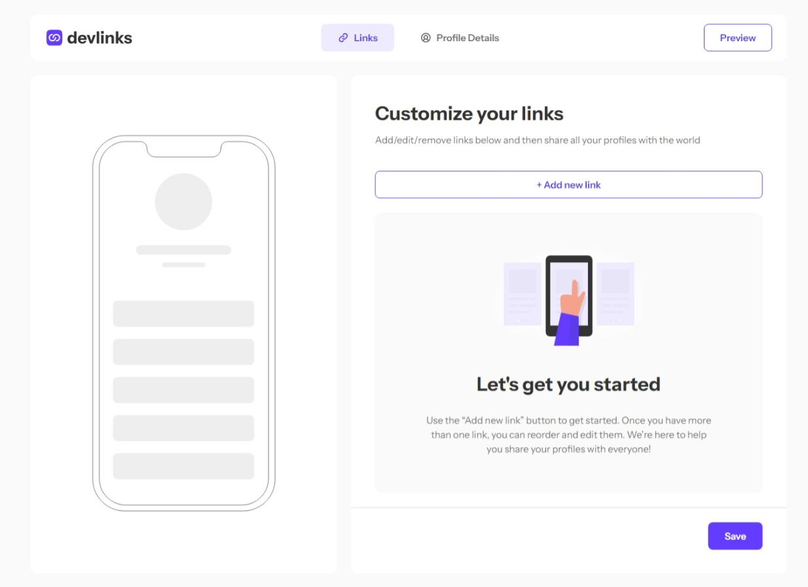

# Link-sharing app

### [Live Site](https://your-live-site-url.com)

## Table of contents

- [Link-sharing app](#link-sharing-app)
    - [Live Site](#live-site)
  - [Table of contents](#table-of-contents)
  - [Overview](#overview)
    - [About](#about)
    - [Built with](#built-with)
  - [Authors](#authors)

## Overview

### About

Users should be able to:

- Create, read, update, delete links and see previews in the mobile mockup
- Receive validations if the links form is submitted without a URL or with the wrong URL pattern for the platform
- Drag and drop links to reorder them
- Add profile details like profile picture, first name, last name, and email
- Receive validations if the profile details form is saved with no first or last name
- Preview their devlinks profile and copy the link to their clipboard
- View the optimal layout for the interface depending on their device's screen size
- See hover and focus states for all interactive elements on the page
- Save details to a database (build the project as a full-stack app)
- Create an account and log in (add user authentication to the full-stack app)

### Built with

- [Next.JS](https://nextjs.org/) - React framework
- [Sass](https://sass-lang.com/) - Styling
- [Mongodb](https://www.mongodb.com/) - Database

## Authors
- Seikou
  - [Portfolio](https://portfolio-selly361.vercel.app/)
  - [Linkedin](https://www.linkedin.com/in/seikou-sillah-883912249/)

- Whitelisted
  - [Portfolio](https://ismonov.ru/en)

